# RMInterfaceSetting/Настройки интерфейса

## Структура таблицы

| № | Имя поля | Тип | Длина | Назначение |
| ---: | --- | --- | ---: | --- |
| 1 | ID | Integer | | Уникальный идентификатор |
| 2 | RMInterfaceID | Integer | | ID интерфейса |
| 3 | Name | Varchar | 100 | Название настройки |
| 4 | Val | Varchar | 255 | Значение настройки |
| 5 | BDOCode | Integer | | Код БД, в которой произведены изменения |
| 6 | CHNG | Numeric | 18 | Счетчик изменений |
| 7 | OwnerBDO | Integer | | Код БД, которой передали записи при персональной синхронизации |

## Данные настроек интерфейсов

|ID|RMINTERFACEID|NAME|VAL|BDOCODE|CHNG|OWNERBDO|
|--|-------------|----|---|-------|----|--------|
|2152149|1|ViewClock|1|0|495256|0|
|2152150|1|BackGroundScreenOSData|8944494|0|495251|0|
|2152151|1|BackGroundScreenOS|1|0|495252|0|
|2152152|1|IntegerInput|2|0|495267|0|
|2152153|1|DinamicVisualFilter|1|0|495327|0|
|2152154|1|BeginTextVisualFilter|1|0|495328|0|
|2152155|1|TouchScreenBID|0|0|61828|0|
|2152156|1|TouchScreenEditID|0|0|495277|0|
|2152157|1|TouchScreenAuthorisID|2151999|0|495282|0|
|2152158|1|ViewExProp|0|0|61831|0|
|2152159|1|ViewStatusLine|1|0|495254|0|
|2152160|1|ViewLanguage|1|0|495257|0|
|2152161|1|ViewKeybMode|1|0|495258|0|
|2152162|1|ViewECR|0|0|61835|0|
|2152163|1|ViewPaymetAuthoris|0|0|61836|0|
|2152164|1|ViewTopP1|1|0|61837|0|
|2152165|1|ViewTopP2|11|0|61838|0|
|2152166|1|ViewTopP3|14|0|61839|0|
|2152167|1|ViewTopP4|15|0|61840|0|
|2152168|1|ViewBotP1|3|0|61841|0|
|2152169|1|ViewBotP2|5|0|61842|0|
|2152170|1|ViewBotP3|7|0|61843|0|
|2152171|1|ViewBotP4|4|0|61844|0|
|2152172|1|MainFont|Arial,14,1,-2147483640,1|0|495249|0|
|2152173|1|HierVisual|1|0|495320|0|
|2152174|1|TouchScreenTID|0|0|61847|0|
|2152175|1|TouchScreenRID|0|0|61848|0|
|2152176|1|TouchScreenLID|0|0|61849|0|
|2152177|1|TouchScreenVisualID|0|0|495278|0|
|2152178|1|TouchScreenScale|100|0|61851|0|
|2152179|1|ViewUser|1|0|495255|0|
|2152180|1|ViewSessionRemain|1|0|495262|0|
|2152181|1|ViewSessionDuration|0|0|495263|0|
|2152182|1|ViewPartsPos|0;№;5&#124;1;Код;10&#124;3;Наименование;40&#124;8;Кол-во;15&#124;9;Цена;15&#124;10;Сумма;15|0|495295|0|
|2152183|1|RegistrFont|Arial,14,1,-2147483640,204|0|61856|0|
|2152184|1|RegistrTabloFont|Impact,48,0,-2147483640,204|0|61857|0|
|2152185|1|StatusLineFont|Arial,10,1,15262945,204|0|495250|0|
|2152186|1|ShowRemain|0|0|495266|0|
|2152187|1|TouchScreenSupervisorID|0|0|495283|0|
|2152188|1|ViewFullPath|0|0|61861|0|
|2152189|1|ViewPartsVis|1;Код;10&#124;3;Наименование;75&#124;4;Цена;15|0|495314|0|
|2152190|1|VisualBottomMargin|5|0|495323|0|
|2152191|1|VisualTopMargin|5|0|495324|0|
|2152192|1|VisualLeftMargin|5|0|495325|0|
|2152193|1|VisualRightMargin|5|0|495326|0|
|2152194|1|ViewMultiReceiptsPanel|0|0|61867|0|
|2152195|1|ViewTotWareGroupPicture|0|0|61868|0|
|2152196|1|ViewTotWareGroupType|0|0|61869|0|
|2152197|1|ViewTotWareGroupWidth|25|0|61870|0|
|2152198|1|ViewTotWareGroup00ID|0|0|61871|0|
|2152199|1|ViewTotWareGroup01ID|0|0|61872|0|
|2152200|1|ViewTotWareGroup02ID|0|0|61873|0|
|2152201|1|ViewTotWareGroup03ID|0|0|61874|0|
|2152202|1|ViewTotWareGroup04ID|0|0|61875|0|
|2152203|1|ViewTotWareGroup05ID|0|0|61876|0|
|2152204|1|ViewTotWareGroup06ID|0|0|61877|0|
|2152205|1|ViewTotWareGroup07ID|0|0|61878|0|
|2152206|1|ViewTotWareGroup08ID|0|0|61879|0|
|2152207|1|ViewTotWareGroup09ID|0|0|61880|0|
|2152208|1|ViewTotWareGroupSummType|0|0|61881|0|
|2152209|1|VisualDialogType|0|0|495315|0|
|2152210|1|HierPicture|0|0|495321|0|
|2152211|1|ScrollSize|17|0|61884|0|
|2152212|1|CaptionSize|25|0|61885|0|
|2152213|1|TouchScreenSelectID|0|0|495280|0|
|2152214|1|VisualSort|2|0|495319|0|
|2152215|1|ViewTopPayment|1|0|61888|0|
|2152216|1|ViewBotPayment|0|0|61889|0|
|2152217|1|SetMainWindowSize|0|0|61890|0|
|2152218|1|VisualHotKey|0|0|495329|0|
|2152219|1|ViewInterlasedPositions|0|0|495294|0|
|2152220|1|ViewPositionInfo|0|0|61893|0|
|2152221|1|VisualPositiveRemainOnly|0|0|495330|0|
|2152222|1|ViewCurrency|0|0|495261|0|
|2152223|1|TouchScreenHallPlanID|0|0|495284|0|
|2152224|1|TouchScreenReserveInfoID|0|0|495285|0|
|2157632|1|ViewCurrentPrintGroup|0|0|495260|0|
|2152225|1|TouchScreenRegistrationID|2158966|0|495286|0|
|2152226|1|TouchScreenPaymentID|2158968|0|495287|0|
|2152227|1|VisualFilterType|0|0|495322|0|
|2152228|1|ViewPartsSelectRec|5;№ РМ;7&#124;6;№ док.;8&#124;7;№ смены;8&#124;14;Дата;12&#124;15;Время;12&#124;0;Владелец;15&#124;1;Вид;5&#124;2;Сумма;12&#124;3;Статус;10&#124;4;Разрез;11|0|495309|0|
|2152229|1|ViewPartsRestoreRec|5;№ РМ;7&#124;6;№ док.;7&#124;7;№ смены;8&#124;0;Владелец;14&#124;1;Вид;5&#124;2;Сумма;10&#124;3;Статус;8&#124;4;Разрез;9&#124;8;Зал/Т.о.;12&#124;10;Клиент;10&#124;9;Зарезервирован на;10|0|495300|0|
|2152230|1|TouchScreenStretch|1|0|495268|0|
|2152231|1|NotificationFormTransparency|22|0|495351|0|
|2152232|1|NotificationFormColor|15780518|0|495352|0|
|2152233|1|NotificationFormGradient|0|0|495353|0|
|2152234|1|NotificationFormFont|Tahoma,10,1,-2147483640,204|0|495354|0|
|2152235|1|ViewPC|1|0|495259|0|
|2152236|1|TouchScreenVisualClientID|0|0|495279|0|
|2153819|1|ViewPartsVisClient|0;Код;20&#124;1;Имя;40&#124;7;Факт. адрес;40|0|495341|0|
|2153820|1|VisualClientBottomMargin|0|0|495342|0|
|2153821|1|VisualClientTopMargin|0|0|495343|0|
|2153822|1|VisualClientLeftMargin|16|0|495344|0|
|2153823|1|VisualClientRightMargin|0|0|495345|0|
|2153824|1|DynamicVisualClientFilter|1|0|495346|0|
|2153825|1|BeginTextVisualClientFilter|1|0|495347|0|
|2153826|1|VisualClientFilterType|0|0|495348|0|
|2157633|1|SyncState|0|0|61919|0|
|2157634|1|SelectionFormRowFont|Arial,14,1,-2147483640,204|0|495269|0|
|2157635|1|SelectionFormRowHeightPercent|100|0|495270|0|
|2157636|1|NotificationBottomMargin|0|0|495271|0|
|2157637|1|NotificationTopMargin|0|0|495272|0|
|2157638|1|NotificationLeftMargin|16|0|495273|0|
|2157639|1|NotificationRightMargin|0|0|495274|0|
|2157640|1|ServicePointColWidth|15|0|495275|0|
|2157641|1|ShowVertScrollBar|0|0|495276|0|
|2157642|1|TouchScreenSelectListID|0|0|495281|0|
|2157643|1|TouchScreenMenuID|0|0|495288|0|
|2157644|1|TouchScreenAspectID|0|0|495289|0|
|2157645|1|TouchScreenDocViewID|0|0|495290|0|
|2157646|1|AuxScreenDocOpen|0|0|495292|0|
|2157647|1|AuxScreenDocClosed|0|0|495293|0|
|2157648|1|ReturnDividePosBottomMargin|20|0|495296|0|
|2157649|1|ReturnDividePosTopMargin|20|0|495297|0|
|2157650|1|ReturnDividePosLeftMargin|20|0|495298|0|
|2157651|1|ReturnDividePosRightMargin|20|0|495299|0|
|2157652|1|RestoreRecBottomMargin|20|0|495301|0|
|2157653|1|RestoreRecTopMargin|20|0|495302|0|
|2157654|1|RestoreRecLeftMargin|20|0|495303|0|
|2157655|1|RestoreRecRightMargin|20|0|495304|0|
|2157656|1|SelectDocBottomMargin|20|0|495310|0|
|2157657|1|SelectDocTopMargin|20|0|495311|0|
|2157658|1|SelectDocLeftMargin|20|0|495312|0|
|2157659|1|SelectDocRightMargin|20|0|495313|0|
|2157660|1|VisualLifeBeg1|2147483647|0|495332|0|
|2157661|1|VisualLifeEnd1|2147483647|0|495333|0|
|2157662|1|VisualLifeColor1|-16777211|0|495334|0|
|2157663|1|VisualLifeBeg2|2147483647|0|495335|0|
|2157664|1|VisualLifeEnd2|2147483647|0|495336|0|
|2157665|1|VisualLifeColor2|-16777211|0|495337|0|
|2157666|1|VisualLifeBeg3|2147483647|0|495338|0|
|2157667|1|VisualLifeEnd3|2147483647|0|495339|0|
|2157668|1|VisualLifeColor3|-16777211|0|495340|0|
|2157669|1|VisualClientSort|1|0|495349|0|
|2157670|1|HierVisualClient|1|0|495350|0|
|2157671|1|NotificationFormBottomMargin|0|0|495355|0|
|2157672|1|NotificationFormTopMargin|0|0|495356|0|
|2157673|1|NotificationFormLeftMargin|16|0|495357|0|
|2157674|1|NotificationFormRightMargin|0|0|495358|0|
|2157675|1|ViewPartsDocView|5;№ РМ;7&#124;6;№ док.;8&#124;7;№ смены;8&#124;1;Вид;5&#124;2;Сумма;12&#124;4;Разрез;11&#124;8;Зал/Т.о.;12&#124;10;Клиент;17&#124;9;Зарезервирован на;20|0|495359|0|
|2157693|1|TouchScreenWayBillID|2157692|0|61962|0|
|2158941|1|StatusLineColor|8944494|0|495264|0|
|2158942|1|StatusLineBorderColor|12364697|0|495265|0|
|2158943|1|TouchScreenEGAISDocsID|0|0|61965|0|
|2406945|1|VisualSearchFilterFont|Arial,14,1,-2147483640,1|0|495331|0|
|2415612|1|ViewDocKind|0|0|495253|0|
|2415613|1|TouchScreenFlipPOSWellcomeScreenID|0|0|495291|0|
|2415614|1|OtherWinsBottomMargin|5|0|495305|0|
|2415615|1|OtherWinsTopMargin|5|0|495306|0|
|2415616|1|OtherWinsLeftMargin|0|0|495307|0|
|2415617|1|OtherWinsRightMargin|0|0|495308|0|
|2415618|1|VisualDatasetKind|0|0|495316|0|
|2415619|1|VisualDefaultParentGroupCode|0|0|495317|0|
|2415620|1|VisualHigherGroupBlocked|0|0|495318|0|
|2415621|1|QRScale|0|0|495360|0|

## Внешний вид настроек

Все настройки наичнающиеся на TouchScreen - это ссылки на таблицу TouchLayt.
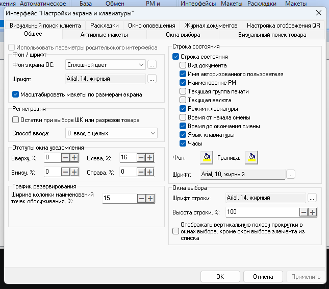
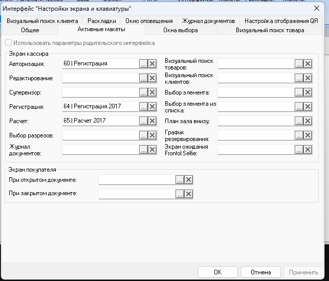
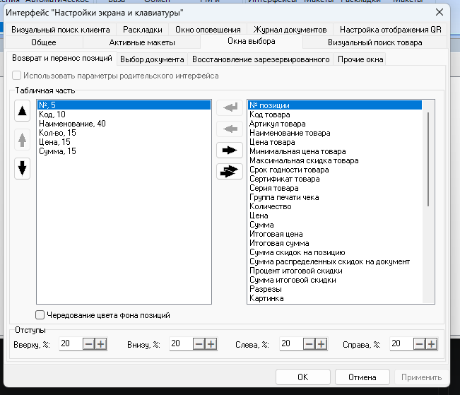
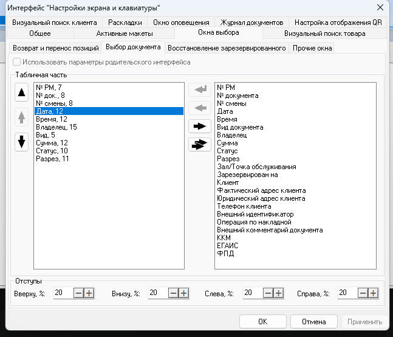
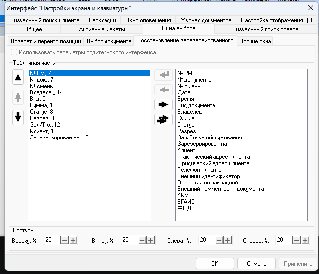
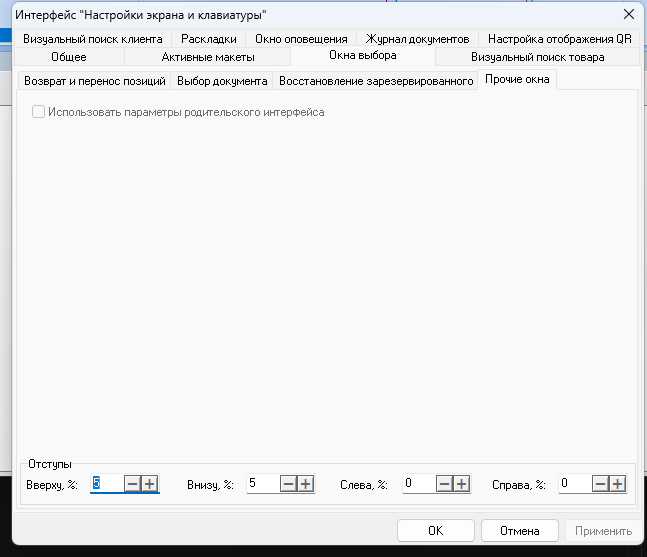
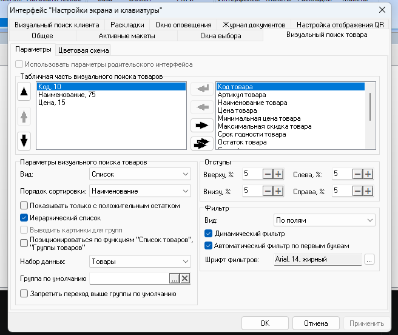
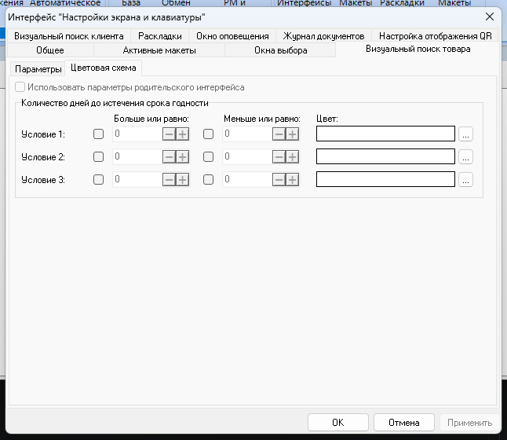
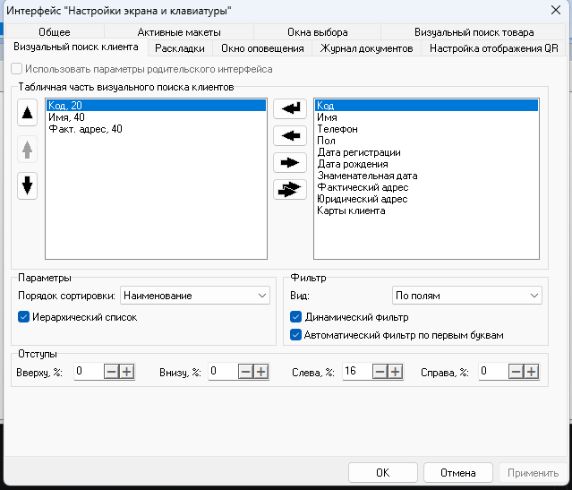
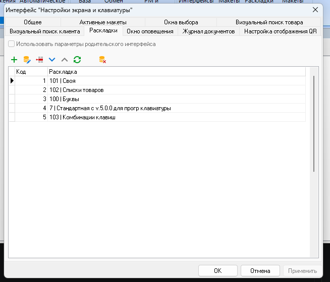
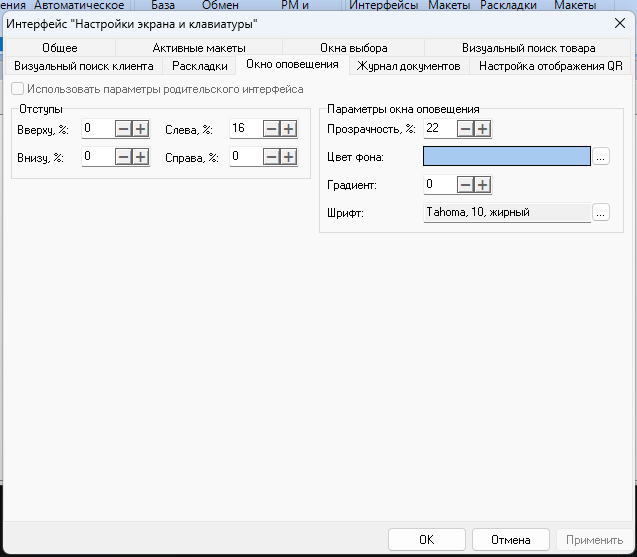
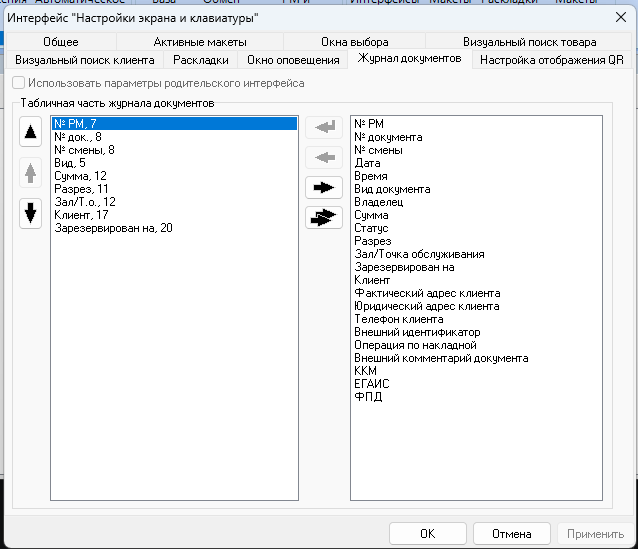
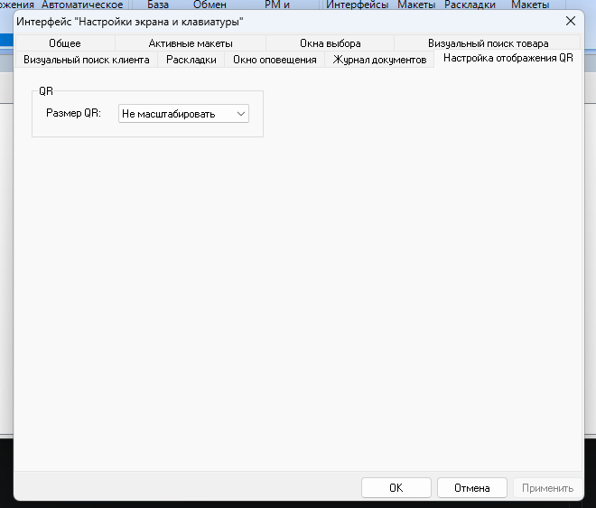